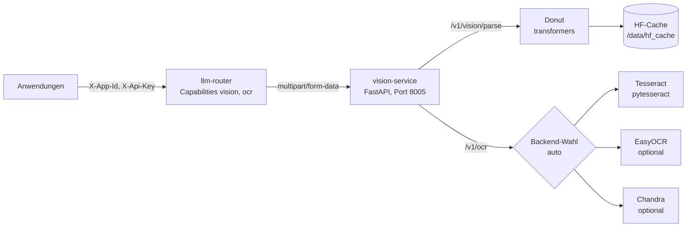

# vision-service

[](https://github.com/janpow77/vision-service/actions/workflows/image.yml)

[](LICENSE)

**Vision- und OCR-Dienst über HTTP: liest Text aus Bildern (Tesseract, optional EasyOCR/Chandra) und
extrahiert mit Donut strukturierte Felder aus Belegen. Angesprochen über einen vorgeschalteten LLM-Router,
analog zum [reranker-service](https://github.com/janpow77/reranker-service).**

## Auf einen Blick

- **Klassisches OCR** unter `POST /v1/ocr`: Text plus mittlere Konfidenz, Backend wählbar oder per `auto`.
- **Strukturiertes Parsing** unter `POST /v1/vision/parse` mit Donut (CORD-v2), inklusive heuristisch gemappter Felder wie Gesamtbetrag und Datum.
- **Deutsch und Englisch ab Werk:** Tesseract mit den Sprachpaketen `deu` und `eng` ist im Abbild enthalten.
- **Sofort startklar:** Das Donut-Modell ist im Docker-Abbild vorgeladen, der erste Start braucht keinen Download.
- **CPU oder GPU:** `VISION_DEVICE=auto` nimmt CUDA, wenn verfügbar; GPU-Override per `compose.gpu.yaml`.
- **Schutzgrenzen:** optionaler `X-Api-Key`, Größenlimit je Bild.

| Backend | ID | Capability | Standard | Zweck |
|---------|----|-----------|----------|-------|
| Donut | `donut-cord-v2` | `vision` | aktiv | OCR-frei, strukturierte Beleg-Extraktion (CORD-v2) |
| Tesseract | `tesseract` | `ocr` | aktiv | Klassisches OCR, Deutsch und Englisch |
| EasyOCR | `easyocr` | `ocr` | optional | Deep-Learning-OCR, mehrsprachig, GPU-fähig |
| Chandra | `chandra` | `ocr` | optional | Best-Effort-Wrapper, falls das Modul vorhanden ist |

## Architektur



Anwendungen sprechen den Dienst nicht direkt an, sondern über den llm-router, der Anfragen nach Capability
an einen passenden vision-service weiterleitet.

## Schnellstart

Voraussetzung: Docker mit Compose-Plugin.

```bash
sudo mkdir -p /var/lib/vision-service/data
sudo chown 1000:1000 /var/lib/vision-service/data
docker compose up -d          # Abbild ghcr.io/janpow77/vision-service:latest, CPU
```

Beispiel gegen das Abbild `:latest` auf CPU, mit einem selbst erzeugten Testbild `rechnung.png`
(tatsächliche Ausgabe):

```console
$ curl -s -X POST http://localhost:8005/v1/ocr -F image=@rechnung.png -F backend=tesseract
{"backend":"tesseract","text":"Rechnung Nr. 4711 vom 11.05.2026 Gesamtbetrag: 123,45 EUR","confidence":0.955,"duration_ms":414,"languages":"deu+eng"}

$ curl -s -X POST http://localhost:8005/v1/vision/parse -F image=@rechnung.png -F model=donut-cord-v2
{"model":"naver-clova-ix/donut-base-finetuned-cord-v2","raw":"<s_menu><s_nm> Rechnung Nr. 4711 vom</s_nm><s_price> 11.05.2026</s_price></s_menu><s_total><s_total_price> 123,45 EUR</s_total_price></s_total>","fields":{"total_amount":"123,45"},"json":{"menu":{"nm":"Rechnung Nr. 4711 vom","price":"11.05.2026"},"total":{"total_price":"123,45 EUR"}},"duration_ms":18496,"device":"cpu"}
```

Der Donut-Aufruf lief ohne Vorladen (`VISION_EAGER_LOAD=false`); die 18,5 s enthalten das Laden des Modells.
CORD-v2 ist auf Kassenbons trainiert, deshalb landet das Rechnungsdatum hier im Feld `menu.price`.

Ohne Docker, für die Entwicklung (Tesseract muss dann lokal installiert sein):

```bash
pip install -e ".[dev]"            # EasyOCR zusätzlich: pip install -e ".[dev,easyocr]"
uvicorn vision_service.main:app --host 0.0.0.0 --port 8005
pytest            # mockt Donut, Tesseract, EasyOCR und Chandra, kein Modell-Download
ruff check .
```

<details>
<summary><b>API</b></summary>

| Methode | Pfad | Zweck |
|---------|------|-------|
| GET | `/health` | Liveness inkl. Backend-Status und GPU-Info |
| GET | `/v1/models` | Modell-Liste im OpenAI-Stil, nur verfügbare Backends (`capabilities: ["vision"]` bzw. `["ocr"]`) |
| POST | `/v1/vision/parse` | Donut, strukturiert |
| POST | `/v1/ocr` | OCR-Backend mit `auto`-Routing |
| GET | `/` | Dienstinfo mit Endpunktliste |

Beide POST-Endpunkte erwarten `multipart/form-data`, damit Bilder unverändert durchgereicht werden.

**`POST /v1/vision/parse`**: Felder `image` (JPEG/PNG/TIFF/BMP/WEBP) und `model`
(Standard `donut-cord-v2`; auch `donut` oder eine Modell-ID `naver-clova-ix/donut…`). Antwort:

```json
{
  "model": "naver-clova-ix/donut-base-finetuned-cord-v2",
  "raw": "<s_total>123.45</s_total><s_date>2026-05-11</s_date>",
  "fields": {"total_amount": "123.45", "invoice_date": "2026-05-11"},
  "json": {"total": "123.45", "date": "2026-05-11"},
  "duration_ms": 1872,
  "device": "cuda"
}
```

**`POST /v1/ocr`**: Felder `image`, `backend` (`auto` | `tesseract` | `easyocr` | `chandra`, Standard `auto`)
und optional `lang` (Tesseract: `deu+eng`, EasyOCR: `de,en`). Antwort:

```json
{
  "backend": "tesseract",
  "text": "Rechnung Nr. 4711 vom 11.05.2026 ...",
  "confidence": 0.93,
  "duration_ms": 247,
  "languages": "deu+eng"
}
```

`auto` nimmt `VISION_OCR_DEFAULT_BACKEND`, wenn verfügbar, sonst das erste verfügbare aus Tesseract, EasyOCR, Chandra.

Fehlercodes: `400` unbekanntes Backend/Modell oder nicht lesbares Bild, `401` falscher oder fehlender
Schlüssel bei gesetztem `VISION_API_KEY`, `413` Bild größer als `VISION_MAX_IMAGE_BYTES`,
`503` Backend nicht verfügbar.

</details>

<details>
<summary><b>Modelle und Backends</b></summary>

- **Donut** wird im Docker-Build vorgeladen (Build-Argument `PRELOAD_DONUT`, Standard
  `naver-clova-ix/donut-base-finetuned-cord-v2`, etwa 800 MB VRAM und 750 MB Platte).
- **Tesseract** ist als Systempaket installiert (`tesseract-ocr` mit `deu` und `eng`).
- **EasyOCR** wird nur mit dem Extra `easyocr` installiert (`pip install .[easyocr]`); sonst meldet das
  Backend `available=false` und erscheint nicht in `/v1/models`.
- **Chandra** ist Best-Effort: Ist ein Python-Modul `chandra_ocr` oder `chandra` mit `read_text(image)`
  vorhanden und `VISION_ENABLE_CHANDRA=true`, wird es genutzt.

</details>

<details>
<summary><b>Konfiguration (Umgebungsvariablen)</b></summary>

| Variable | Standard | Zweck |
|----------|----------|-------|
| `VISION_PORT` | `8005` | Port von uvicorn |
| `VISION_HOST` | `0.0.0.0` | Wird beim Start nur protokolliert; das Container-Entrypoint bindet fest an `0.0.0.0` |
| `VISION_DEVICE` | `auto` | `auto` / `cpu` / `cuda` / `cuda:0` |
| `VISION_DONUT_MODEL` | `naver-clova-ix/donut-base-finetuned-cord-v2` | Donut-Modell |
| `VISION_DONUT_TASK_PROMPT` | `<s_cord-v2>` | Task-Prompt für Donut |
| `VISION_ENABLE_DONUT` | `true` | Donut-Backend aktiv |
| `VISION_ENABLE_TESSERACT` | `true` | Tesseract-Backend aktiv |
| `VISION_ENABLE_EASYOCR` | `false` | EasyOCR-Backend aktiv (Extra nötig) |
| `VISION_ENABLE_CHANDRA` | `false` | Chandra-Backend aktiv (Modul nötig) |
| `VISION_TESSERACT_LANGS` | `deu,eng` | Tesseract-Sprachen, intern zu `deu+eng` verbunden |
| `VISION_EASYOCR_LANGS` | `de,en` | EasyOCR-Sprachen |
| `VISION_OCR_DEFAULT_BACKEND` | `tesseract` | Wahl bei `backend=auto` |
| `VISION_API_KEY` | leer | Gesetzt: Header `X-Api-Key` wird verlangt |
| `VISION_MAX_IMAGE_BYTES` | `10485760` (10 MB) | Limit je Bild |
| `VISION_MAX_PDF_PAGES` | `50` | Limit Seiten je PDF <!-- TODO: im Code derzeit ohne Verwendung, es gibt keinen PDF-Endpunkt --> |
| `VISION_MAX_PDF_BYTES` | `41943040` (40 MB) | Limit je PDF <!-- TODO: im Code derzeit ohne Verwendung --> |
| `VISION_EAGER_LOAD` | `true` | Donut beim Start vorladen |
| `HF_HOME` | `/data/hf_cache` | Hugging-Face-Cache |

Nur für Compose (siehe [.env.example](.env.example)):

| Variable | Standard | Zweck |
|----------|----------|-------|
| `IMAGE_TAG` | `latest` | Tag des GHCR-Abbilds |
| `VISION_BIND` | `0.0.0.0` | Host-Adresse des Port-Mappings, z. B. auf eine interne Schnittstelle begrenzen |

Mit Env-Datei starten:

```bash
docker compose --env-file /etc/vision-service/env up -d
```

</details>

<details>
<summary><b>Bau und Betrieb</b></summary>

**Abbild bauen.** Die CI ([image.yml](.github/workflows/image.yml)) baut bei Push auf `master`/`main`,
bei Tags `v*.*.*` und manuell und schiebt nach `ghcr.io/janpow77/vision-service`. Lokal:

```bash
docker build -t ghcr.io/janpow77/vision-service:v0.1 .
docker push ghcr.io/janpow77/vision-service:v0.1
```

Das Donut-Modell wird im Build nach `/opt/hf_cache_baked` geladen und beim ersten Start in das leere
`/data/hf_cache` kopiert. Der Bind-Mount `/var/lib/vision-service/data` hält den Cache dauerhaft.

**GPU.** Voraussetzung sind das nvidia-container-toolkit und ein GPU-Build des Abbilds; mit dem
Standard-Abbild (CPU-Torch) fällt Donut auf CPU zurück.

```bash
docker compose -f compose.yaml -f compose.gpu.yaml up -d
```

**Einbindung in den llm-router.** Nach dem Deploy einen Spoke anlegen:

```yaml
spokes:
  - name: vision
    base_url: http://<vision-host>:8005
    type: openai
    capabilities: [vision, ocr]
    enabled: true
    priority: 10

routes:
  - model_glob: "donut*"
    spoke_id: <id-des-spokes>
  - model_glob: "tesseract"
    spoke_id: <id-des-spokes>
  - model_glob: "easyocr"
    spoke_id: <id-des-spokes>
```

Anwendungen rufen danach `/v1/vision/parse` bzw. `/v1/ocr` am llm-router mit ihren üblichen Headern
(`X-App-Id`, `X-Api-Key`) auf.

</details>

## Dokumentation

- [ARCHITEKTUR.md](ARCHITEKTUR.md): Modulkarte, aus dem Code-Graphen erzeugt
- [CLAUDE.md](CLAUDE.md): Arbeitskontext für Coding-Agenten
- [.env.example](.env.example): Vorlage für die Compose-Umgebung

## Mitwirkung

Issues und Pull Requests sind willkommen. Vor einem PR `pytest` und `ruff check .` ausführen.

## Lizenz

Veröffentlicht unter der [MIT-Lizenz](LICENSE), Copyright (c) 2026 Jan Riener.
